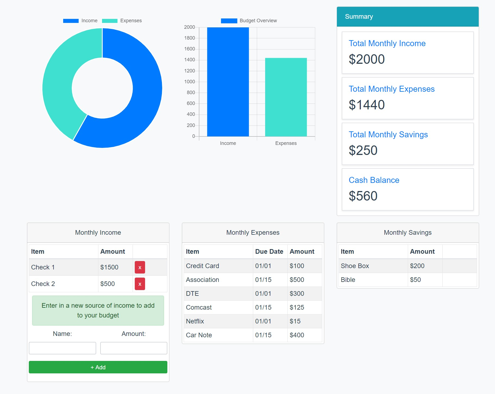

# budgethero_ui

The purpose of this app was to create a easy to use monthly budget view of income and expense, using VueJs



Coming soon... 
- CURD operations
- Backend App with Database
- User Authentication

## Project setup
```
npm install
```

### Compiles and hot-reloads for development
```
npm run serve
```

### Compiles and minifies for production
```
npm run build
```

### Lints and fixes files
```
npm run lint
```

### Customize configuration
See [Configuration Reference](https://cli.vuejs.org/config/).
